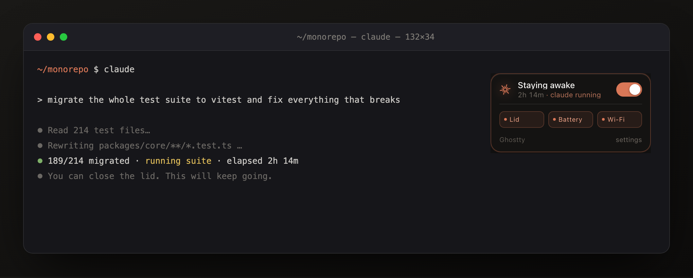
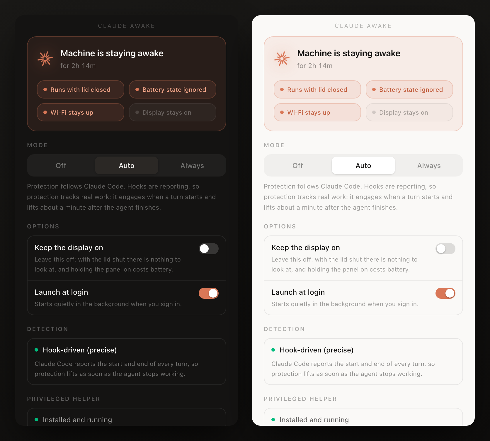

<div align="center">

# Claude Awake

**Close the lid. Let the agent keep working.**

A tiny background app that keeps your laptop running — lid closed, battery state ignored,
Wi-Fi held up — for exactly as long as a Claude Code session is running, and gets out of the
way the moment it stops.

[](https://github.com/keremss7/claude-awake/actions/workflows/ci.yml)
[](LICENSE)
[](#installation)
[](#installation)
[](https://tauri.app)



</div>

---

You start a long refactor, close the lid, and come back to a machine that went to sleep forty
minutes in. Claude Awake fixes that — and then puts every setting back exactly as it found
them, including when it crashes.

It shows up as a small pill stuck to whichever terminal window is in front, and disappears
when you switch away.

## Why not just `sudo pmset -a disablesleep 1`?

That command pulls the right lever. On its own it is four things short:

| | one-liner | Claude Awake |
|---|:---:|:---:|
| Stay awake with the lid closed | ✅ manually, every time | ✅ automatic |
| Ignore a draining battery | ❌ | ✅ low-power mode, battery sleep, standby |
| Keep Wi-Fi from being cut | ❌ | ✅ wake-on-network + TCP keepalive |
| Skip deep standby (which kills the network) | ❌ | ✅ |
| Put it all back when the work is done | ❌ you forget | ✅ automatic, crash included |
| Works on Windows | ❌ | ✅ `powercfg` + NIC power management |

That fifth row is the one that matters. Leaving `disablesleep 1` on is how a laptop flattens
its battery in a bag. Here, protection lifts when the work stops, the privileged helper rolls
everything back on its own if the app dies, and an unclean shutdown is repaired on next start.

## Install

### macOS

Download the `.dmg` from [Releases](https://github.com/keremss7/claude-awake/releases), drag
the app to `/Applications`, and open it once.

The build is unsigned, so Gatekeeper will complain the first time:

```bash
xattr -dr com.apple.quarantine "/Applications/Claude Awake.app"
```

Then run the one-time administrator step — closing the lid without sleeping is root-only on
macOS, and there is no way around that:

```bash
sudo bash "/Applications/Claude Awake.app/Contents/Resources/install-helper.sh"
```

You are never asked again. The settings panel has a **Copy setup command** button if you would
rather not type it.

### Windows

Download the `.exe` installer from [Releases](https://github.com/keremss7/claude-awake/releases)
and run it. The installer registers the helper service for you — no extra step.

> [!NOTE]
> The Windows build compiles and is checked in CI on every push, but it has not yet been
> validated on physical hardware. If you run it, please
> [open an issue](https://github.com/keremss7/claude-awake/issues) with what you see — good or
> bad. That feedback is the fastest path to marking Windows fully supported.

### From source

```bash
git clone https://github.com/keremss7/claude-awake.git
cd claude-awake
npm install
npm run app:build          # or app:build:universal on macOS for Intel + Apple Silicon
```

Requires [Rust](https://rustup.rs), Node 18+, and the Xcode command line tools on macOS.

## Use

Click into any terminal and the pill appears in its top-right corner.

| | |
|---|---|
| **Click the pill** | toggle protection |
| **Hover** | expand to show the lid / battery / Wi-Fi guards |
| **Right-click** | open the settings panel |
| **Menu bar / tray icon** | pick a mode, quit |

Three modes:

| Mode | Behaviour |
|---|---|
| **Off** | nothing is applied |
| **Auto** *(default)* | follows Claude Code — see below |
| **Always** | stays awake until you turn it off |



### Auto mode, and why you want the hooks

Auto mode is only as good as what it can see, and there are two tiers.

**Without hooks** the app can only scan for the `claude` process. That cannot tell a working
agent from a session parked at an empty prompt — so both keep the machine awake. Correct, but
it will happily hold a laptop up all night because you left a terminal open.

**With hooks** Claude Code reports the start and end of every turn. `UserPromptSubmit` opens a
working window, `Stop` closes it, and everything in between — thinking, tool calls, subagents —
counts as work. An idle prompt does not. Protection lifts about a minute after the agent
finishes, and the machine is free to sleep.

```bash
bash scripts/install-hooks.sh            # writes to ~/.claude/settings.json, backup taken
bash scripts/install-hooks.sh --remove   # undo
```

Four events per session, two per turn; each is one loopback `curl`. The settings panel shows
which tier is active under **Detection**.

## How it works

```
┌───────────────────────────┐              ┌────────────────────────────┐
│  Claude Awake.app         │              │  claude-awake-helperd      │
│  (your user account)      │   socket /   │  (root / LocalSystem)      │
│                           │   pipe +     │                            │
│  · overlay + settings     │◄────────────►│  · snapshot power settings │
│  · state machine          │   heartbeat  │  · apply profile           │
│  · caffeinate assertions  │              │  · restore                 │
│  · Claude detection       │              │  · watchdog (5 min)        │
└───────────────────────────┘              └────────────────────────────┘
```

The split is deliberate. The process running as root does exactly four things — snapshot,
apply, restore, heartbeat — and never executes anything it is sent. The request enum is the
entire vocabulary, and every value written to the system comes from a compile-time constant.

**What it actually changes**

<details>
<summary>macOS (<code>pmset</code>)</summary>

| Setting | Value | Why |
|---|---|---|
| `disablesleep` | `1` | the only lever that survives a lid close |
| `sleep`, `disksleep` | `0` | no idle sleep or spindown mid-task |
| `standby`, `autopoweroff` | `0` | deep standby severs the network |
| `womp`, `tcpkeepalive` | `1` | wake for network, keep TCP sessions alive |
| `ttyskeepawake` | `1` | an active tty holds the machine up |
| `lowpowermode`, `lessbright` | `0` (battery) | ignore the battery state |
| `displaysleep` | `0` | **only** if you opt in |

The display is a special case. `disablesleep` suppresses clamshell sleep wholesale, which also
stops macOS from powering the panel down when the lid shuts — so with "Keep the display on"
unchecked, the app watches the lid and issues `pmset displaysleepnow` on close. System sleep
stays blocked; only the panel goes dark.

Only keys the machine actually reports are touched, which guarantees every change can be
undone.

</details>

<details>
<summary>Windows (<code>powercfg</code> + NDIS)</summary>

| Setting | Value | Why |
|---|---|---|
| Lid close action (AC **and** DC) | Do nothing | the equivalent of `disablesleep` |
| Critical + low battery action | Do nothing | ignore the battery state |
| Sleep / hibernate idle timeouts | Never | no idle sleep |
| Wireless adapter power saving | Maximum performance | Windows parks the NIC otherwise |
| `AllowComputerToTurnOffDevice` | Disabled | the setting that actually severs Wi-Fi |
| Display idle timeout | Never | **only** if you opt in |

</details>

### Safety

Changing system power settings is only acceptable if undoing them is guaranteed. Four
independent nets:

1. **Heartbeat** — if the UI stops checking in for five minutes, the helper restores on its own.
2. **Crash recovery** — a snapshot left on disk at startup means we exited uncleanly, so the
   helper rolls it back before accepting any new work.
3. **Bounded writes** — only settings the machine reported are modified, so nothing
   unrestorable can be written.
4. **Process lifetime** — the `caffeinate` child is spawned with `-w <pid>`, so it dies with the
   app even under `kill -9`.

The uninstall scripts restore the power settings *before* removing the service, and check
`disablesleep` one last time on the way out.

The hook listener binds to `127.0.0.1` only and requires a token from `~/.claude-awake/token`
(mode `0600`). Without it, any web page could POST to loopback — no CORS preflight is required
for that — and pin your laptop awake.

## Known limitations

- **Window tracking is best-effort.** The pill follows the frontmost terminal by polling every
  600 ms. On macOS it is configured to survive full-screen apps and Space switches, but a fast
  drag across multiple monitors can leave it a frame behind.
- **Clicking the pill focuses the app**, so the terminal's title bar dims for a moment. There is
  no clean fix on macOS short of making the overlay an `NSPanel`.
- **The terminal area under the pill is not clickable** — 236×46 px in the top-right corner. The
  window hugs the card exactly, so there is no dead space beyond it.
- **Terminals are recognised from a list** in [`src/tracker/mod.rs`](src-tauri/src/tracker/mod.rs).
  If yours is missing, run `cargo run --example windows`, and add the printed owner name (PRs
  welcome).
- **Windows has no lid-close display handling yet.** The macOS side darkens the panel when the
  lid shuts; the Windows equivalent needs `GUID_LIDSWITCH_STATE_CHANGE` notifications and is not
  implemented.

## Project layout

```
src/                      React UI
  overlay/Pill.tsx        the pill pinned to the terminal
  panel/Panel.tsx         settings window
  ui/ClaudeMark.tsx       the burst mark (kept in step with make-icons.py)
src-tauri/src/
  main.rs                 Tauri setup, state machine, tray, window tracking
  lib.rs                  UI-free core — the helper links this too
  protocol.rs             the socket contract
  helper/                 the privileged daemon and its transports
  power/                  pmset (macOS) / powercfg (Windows)
  tracker/                frontmost-window lookup
  detect.rs               Claude detection: process scan + hook listener
  keepalive.rs            unprivileged layer (caffeinate / SetThreadExecutionState)
  examples/windows.rs     window-tracking diagnostic
scripts/                  install/uninstall scripts, icon generator
```

## Contributing

Issues and PRs welcome — especially Windows testing and terminal-detection additions. See
[CONTRIBUTING.md](CONTRIBUTING.md).

## License

[MIT](LICENSE)

---

<sub>Not affiliated with, endorsed by, or sponsored by Anthropic. "Claude" is a trademark of
Anthropic, PBC, used here only to describe what this tool works with. The burst mark is drawn
from scratch for this project.</sub>
